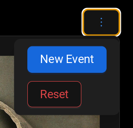

[](https://sonarcloud.io/summary/new_code?id=josephrkramer_batuu-scanner2)

# Batuu Scanner

Typescript/React Batuu Code Scanner based on [Html5-QRCode](https://github.com/mebjas/html5-qrcode). With additions of Galaxy's Edge Aztec Code mapping based on [Andrew Mohawk's Star Wars Aztec Barcodes](https://github.com/AndrewMohawk/StarwarsAztec).

This library and application are in no way affiliated with or sponsored by Walt Disney World. It is a free, open source, fan sponsored library and application.

In this library, several changes have been applied over the original port:

- Changed from QR Codes to Aztec Codes
- Added a Crate Decoder class to interpret the codes returned by the crates in Galaxy's Edge.

## AARC Scanner

### Test scanning of crates

See [https://josephrkramer.github.io/batuu-scanner2/](https://josephrkramer.github.io/batuu-scanner2/)

The following image can be used to test the scanning of crates.


### Test scanning of chain code alignment

After the minimum of 3 chain code scans, the "Decode Chain Code" button will be shown. This will display 1 to 2 alignments. If the initial alignment matched their choices in the event, the player will get a single alignment option. If the player made different choices in the game from their initial alignment, they will be shown both their derived alignment and their original alignment.

#### Test codes for scanning

##### Light


##### Dark


### Data Management

#### New events and full reset

Use the dropdown in the upper right to reset the data back to proper states.



#### URL Parameters

If the page fails to load, you can clear the local storage by submitting the `reset` URL parameter.

### Pre-populate with cargo

See [https://josephrkramer.github.io/batuu-scanner2/?cargo](https://josephrkramer.github.io/batuu-scanner2/?cargo)

## Development

Be sure to load the submodules after cloning the repo.

```
git submodule init
git submodule update
```

To update new versions of the puzzle, pull the new code and commit the changes.

```
cd public/coolant-stabilizer
git pull
cd ../..
git add .
git commit
```
