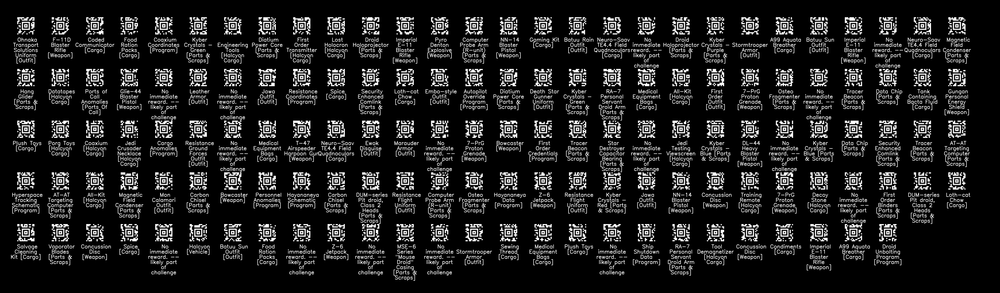

# Batuu Scanner

Javascript Batuu Code Scanner based on [Html5-QRCode](https://github.com/mebjas/html5-qrcode). With additions of Galaxy's Edge Aztec Code mapping based on [Andrew Mohawk's Star Wars Aztec Barcodes](https://github.com/AndrewMohawk/StarwarsAztec)

This library and application are in no way affiliated with or sponsored by Walt Disney World. It is a free, open source, fan sponsored library and application.

In this library, several changes have been applied over the original port:

- Changed from QR Codes to Aztec Codes
- Added a Crate Decoder class to interpret the codes returned by the crates in Galaxy's Edge.

## AARC Scanner
See [https://josephrkramer.github.io/batuu-scanner2/aarc/](https://josephrkramer.github.io/batuu-scanner2/aarc/)

### Pre-populate with cargo
See [https://josephrkramer.github.io/batuu-scanner2/aarc/?cargo](https://josephrkramer.github.io/batuu-scanner2/aarc/?cargo)

### Empty the cargo bay
See [https://josephrkramer.github.io/batuu-scanner2/aarc/?reset](https://josephrkramer.github.io/batuu-scanner2/aarc/?reset)
